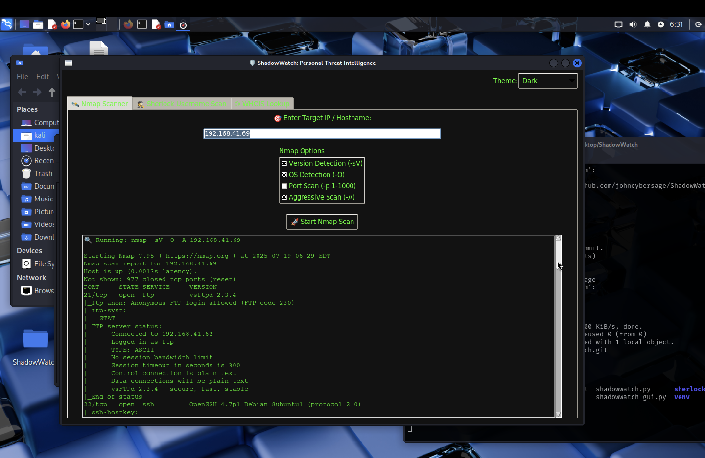
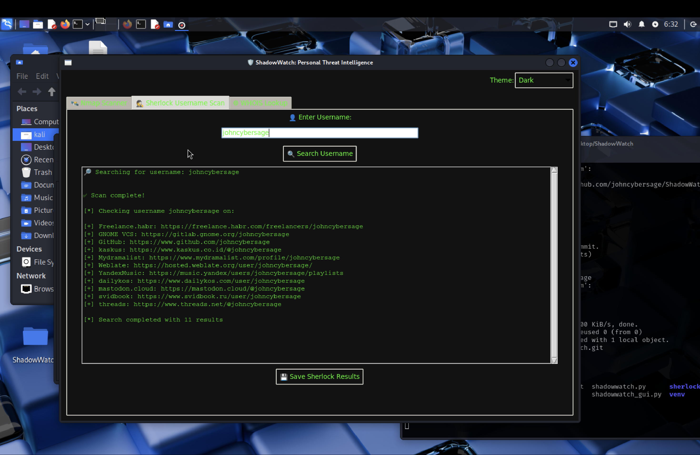
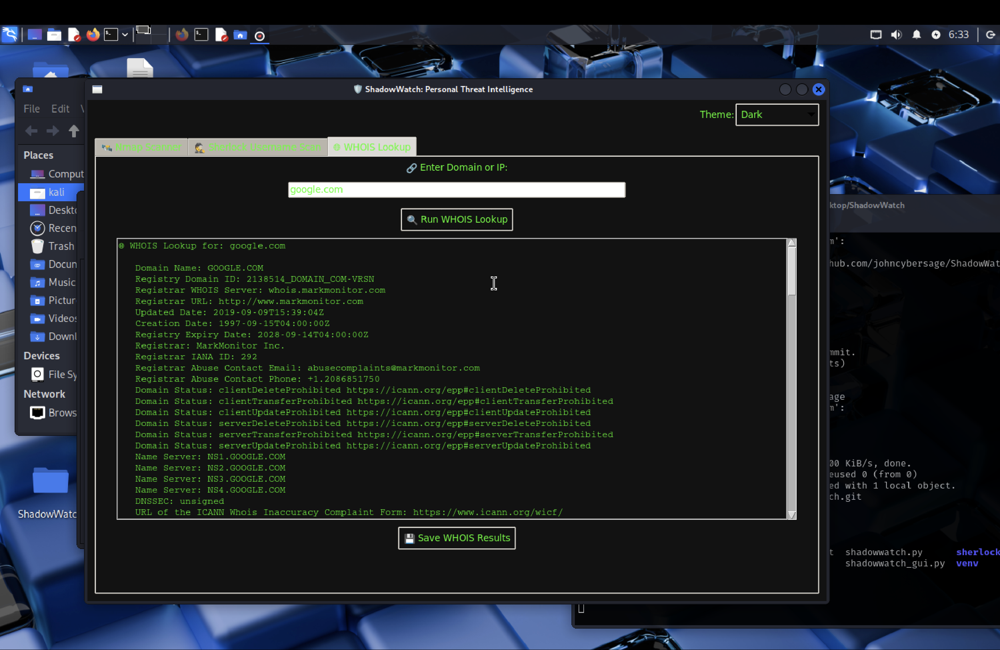

# 🕵️‍♂️ ShadowWatch

**ShadowWatch** is a personal threat intelligence dashboard for ethical hackers and cybersecurity learners. It integrates tools like **Sherlock**, **Nmap**, and **WHOIS lookup** into one powerful Python GUI interface.

> 🔒 For **educational and lawful use only**. Always respect privacy and ethical guidelines.

---

## 🚀 Features

- 🔍 **Username Footprinting** – Search 300+ platforms using Sherlock
- 🌐 **Nmap Integration** – Run customizable scans:
  - Version Detection
  - OS Detection
  - Port Scanning
  - Stealth Modes (e.g., `-Pn`)
- 📛 **WHOIS Lookup** – Identify domain registration and ownership
- 💾 **Save Results** – Export scan outputs as `.txt` reports
- 🖥️ **Tabbed GUI** – Tkinter-based interface with:
  - Nmap Scanner tab
  - WHOIS tab
  - Sherlock tab
  - Shared result display
  - Save button

---

## 🕵️ Sherlock Integration

Easily perform **username footprinting** with Sherlock inside ShadowWatch.  
Search over **300+ social media platforms** with just a single click — right from the GUI.

---

## 🖼️ Screenshots

### 🔧 ShadowWatch Main GUI


### 🌐 Nmap Scan with Options


### 📛 WHOIS Lookup Result


---

Make sure sherlock is in the same folder or PATH.
🗂️ Project Structure

ShadowWatch/
│
├── shadowwatch.py        # Main GUI script
├── install.sh            # Setup script
├── sherlock/             # Sherlock tool folder
├── screenshots/          # Screenshots for documentation
├── README.md             # You're here!
└── requirements.txt      # (Optional)

🎯 Roadmap / Coming Soon
    🔑 API key integration for more advanced services
    🧠 Threat score and visualizations
    🌙 Dark mode GUI
    📡 Passive DNS / VirusTotal Integration

🤝 Contributing

Pull requests are welcome. For major changes, open an issue first to discuss what you'd like to change or add.
📜 License

MIT License – Free to use for ethical and educational purposes.
🙋‍♂️ Author

## 🙋‍♂️ Author

Developed with 🖤 by **John Raj**  
🎓 Cybersecurity Student | 🛡️ Ethical Hacking Enthusiast  
🔗 [GitHub](https://github.com/johncybersage) • [LinkedIn](https://www.linkedin.com/in/your-link)

---

## 👨‍💻 About Me

I’m **John Raj**, a passionate cybersecurity student and ethical hacking enthusiast, currently pursuing my B.E. in CSE (Cyber Security) at Sri Krishna College of Technology. I love building security tools, exploring open-source intelligence, and automating threat detection using Python.

> 🚀 Always learning | 🛡️ Focused on ethical hacking | 👨‍💻 Building secure digital futures

You can usually find me:
- 🧠 Researching security threats  
- 💻 Creating Python-based security dashboards  
- 🔗 Exploring tools like Nmap, Sherlock, and Wireshark

Let’s connect and grow in the cybersecurity space!


## ⚙️ Installation

```bash
git clone https://github.com/johncybersage/ShadowWatch.git
cd ShadowWatch
bash install.sh
